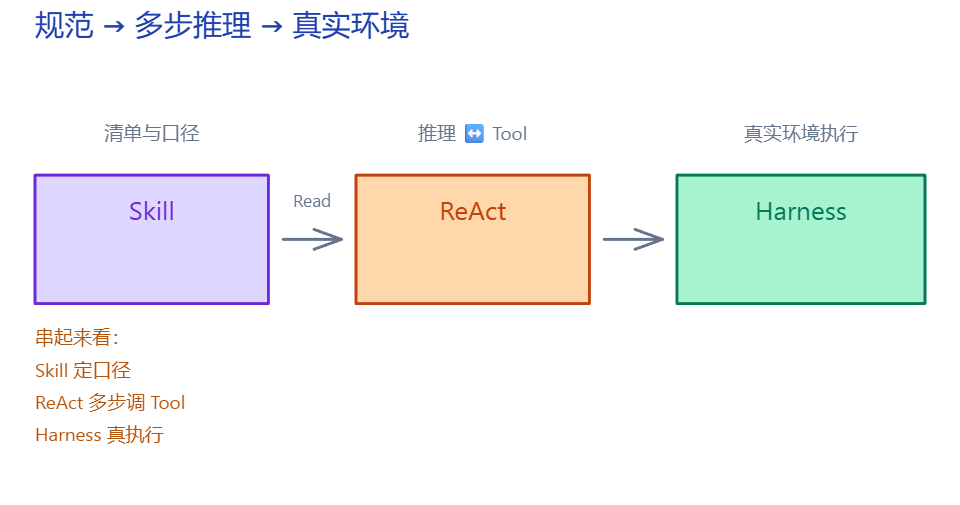
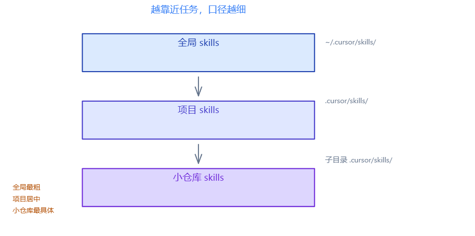
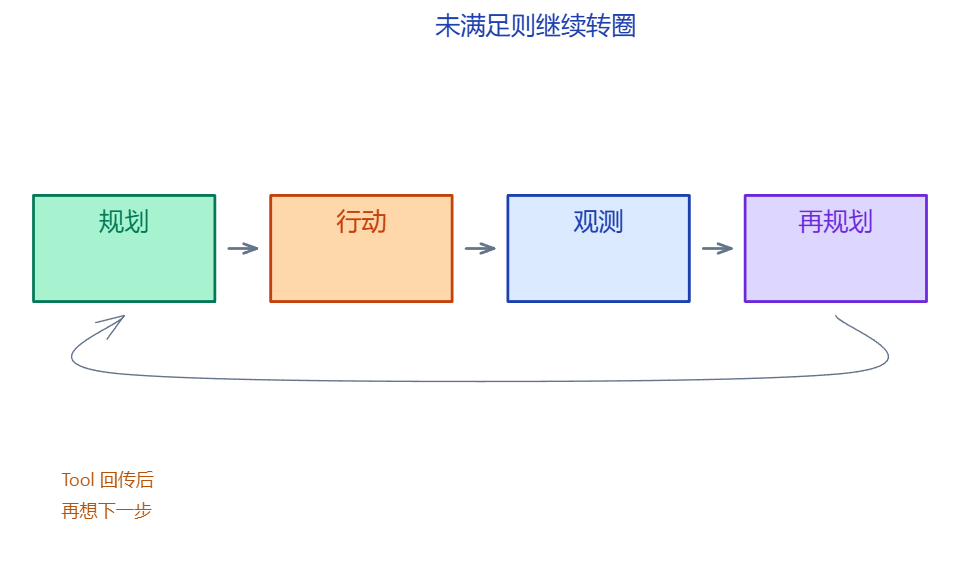
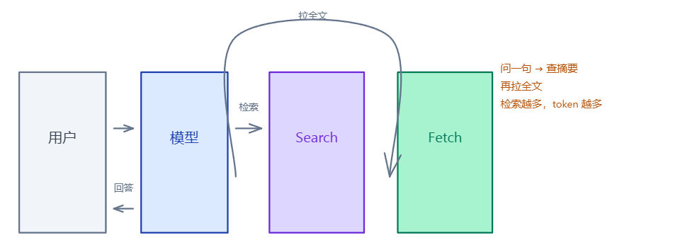
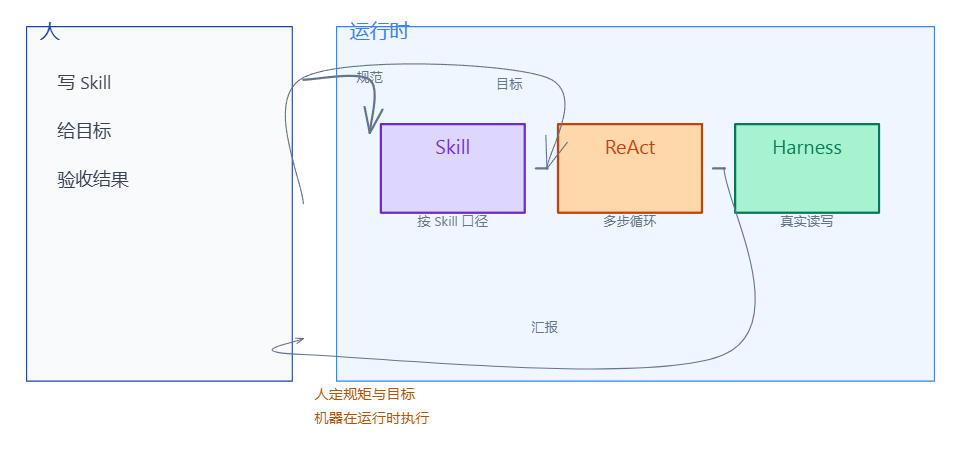

# 介绍

**Skill**、**ReAct**、**Harness** 串起来：规范 → 多步推理与 Tool → 读写与执行真实环境。



- **Skill** — 清单与口径  
- **ReAct** — 推理与 Tool 交替  
- **Harness** — 读写、命令、MCP  

## Skill

`SKILL.md`：重复交代的工作方式写成文件，需要时 **Read**。

### YAML 元数据

| 字段 | 作用 |
| --- | --- |
| **name** | 标识 |
| **description** | 摘要（会话初常只见此项与 name） |
| 正文 | 规则、步骤、示例 |

### 按需加载

1. 会话开始：通常只见各 Skill 的 **name / description**
2. 与当前任务相关 → **Read** 正文
3. 无关 → 不加载

### 分层存放



```
Skill
├── 全局          ~/.cursor/skills/
├── 项目          .cursor/skills/
└── 小仓库        子目录 .cursor/skills/
```

### 嵌套加载

**preload** 列出开工前要 Read 的 skill；按清单逐步加载，不整库灌入。

1. preload 清单 → design-notes → changelog → 领域 skill → 开工  

### preload

开工前要 Read 的 skill 清单。

### design-notes

**当前仍有效**的意图与硬性要求。

### changelog

按日期记变更，**最新在上**。与 design-notes 冲突时，以 changelog **靠上条目**为准。

本目录三件套：**instruction-preload-skills**、**instruction-design-notes**、**instruction-changelog**。

### 违禁词

**forbidden-doc-comment-vocabulary**：词表单一真源，其它 skill 只引用、不复制。

### 习惯与领域语法

- **编码习惯** — 命名、目录拆分  
- **领域语法** — 正反例  
- **对外文档** — README 配置表、设计文不写实现符号  

项目级口径在 **design-notes**。

## ReAct

**Reason + Act**：每轮 Tool 回传后再推理下一步，直到终止。



### 循环与自检

**写代码**：改源码 → linter / 测试 → 未通过则回到改源码。  
**写文档**：写入 → 检索禁用词与成稿规范 → 不合格则再改。

### 联网检索



摘要不足时追加检索轮次；每轮都占 **token**。

### 上下文与 token

上下文大致占比：系统提示与 Skill 约两成，历史对话约四成，Tool 回传约三成，当前文件片段约一成。

- **简单问答** — 短会话，约 1～2 轮  
- **跨文件并跑命令** — 一会话一主目标  
- **历史堆满无关内容** — 新开会话  
- **开工前** — 按 preload 清单预加载  

## Harness

读写真实文件、跑命令与代码；**MCP** 扩展接内网库、工单、监控等。

### 基础 Tool

- **文件** — 读、写  
- **仓库** — 搜索符号  
- **执行** — shell、跑代码读 **stdout**  

### Excel 示例

**准备**

- 人：写 Skill，写明 `xlrd` / `openpyxl` 等依赖与口径  
- AI：Read 该 Skill  

**执行**

- AI：改表、公式、样式  

**收尾**

- AI：汇报改了哪些单元格与输出路径  

### Skill 目录结构

```
excel-ops/
  SKILL.md
  sample-budget.xlsx
  snippets/
```

### MCP

```
Harness（内置 Tool）
    ├── MCP Server A   内网库
    ├── MCP Server B   工单
    └── MCP Server C   监控
```

## 三者配合



**Skill** 定规范；**ReAct** 多步循环；**Harness** 执行。人写 Skill、给目标、验收；重复修订交给 **ReAct + Harness**。

## 配图

成品 **`assets/*.png`**；源稿 **`diagrams/*.excalidraw`**。

讲述者口头展开写在图内**手绘字**；正文只留关键词。旁白文案见 **`tools/excalidraw/instruction-narration.mjs`**。

共用脚本在仓库根 **`tools/excalidraw/`**。说明：[tools/excalidraw/README.md](../../../tools/excalidraw/README.md)。技巧见用户根 **`excalidraw`** skill。
